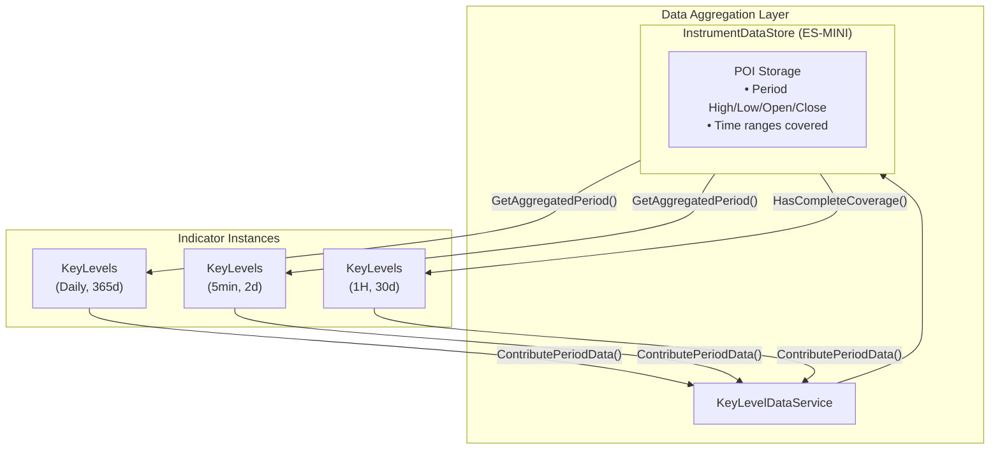

# Cross-Instance Data Aggregation Layer for KeyLevels

## Problem Statement

Multiple KeyLevels indicator instances can be open for the same instrument on different timeframes:
- **Daily chart**: 365 days of history → knows yearly/quarterly data accurately  
- **5-minute chart**: 2 days of history → knows intraday data accurately

We need to aggregate Points of Interest (POI) from all chart instances so that **any indicator can access the combined knowledge**.

### Key Insight: Combining Multiple Sources

To answer "What is today's high?", we might need to combine:
- Past 3 hourly candles from an hourly chart
- Current hour's 5-minute candles from a 5-minute chart

This means we track **time ranges with no gaps**, not coverage ratios.

```mermaid
gantt
    title Time Range Coverage Example
    dateFormat HH:mm
    axisFormat %H:%M
    section Hourly Chart
    09:00-10:00  :h1, 09:00, 1h
    10:00-11:00  :h2, 10:00, 1h
    11:00-12:00  :h3, 11:00, 1h
    section 5-min Chart
    12:00-12:05  :m1, 12:00, 5m
    12:05-12:10  :m2, 12:05, 5m
    12:10-12:15  :m3, 12:10, 5m
    section Combined
    Full Day Coverage :done, 09:00, 3h15m
```

---

## Proposed Architecture

---

## Key Design Decisions

| Decision | Choice | Rationale |
|----------|--------|-----------|
| Instrument ID | `InstrumentInfo.Symbol` | User-specified |
| Extra DLLs | None | Classes hosted in KeyLevels project, ATAS-independent |
| Thread Safety | `ConcurrentDictionary` | Multiple indicator instances |
| Data Storage | POI only | No full price history, just High/Low/Open/Close per period |
| Gap Detection | Time-range based | Combine sources for contiguous coverage |
| Test Support | Mock runtime compatible | Same build patterns as indicator |

---

## Components

### PeriodType Enum

Defines all supported period types:
- FourHour, Daily, Monday, Weekly, Monthly, Quarterly, Yearly

### TimeRange

Represents a contiguous time segment with OHLC data:
- `Start`, `End` - time boundaries
- `Open`, `High`, `Low`, `Close` - price data
- `IsContiguousWith()` - checks if two ranges can be merged (< 1 min gap tolerance)
- `Merge()` - combines two contiguous ranges

### PeriodPoi

Aggregated Points of Interest for a specific period (e.g., "Current Day"):
- Tracks covered time ranges
- Automatically merges contiguous contributions
- `HasCompleteCoverage()` - checks if entire period is covered
- `GetGaps()` - returns time gaps within the period

### InstrumentDataStore

Per-instrument storage for all period POIs:
- Thread-safe via `ConcurrentDictionary`
- `ContributePeriodData()` - add data from an indicator
- `GetPeriodPoi()` - retrieve aggregated data
- `HasCompleteCoverage()` - check coverage status

### KeyLevelDataService

Singleton service locator:
- `Instance` - static singleton access
- `GetStore(symbol)` - get or create store for instrument
- `Reset()` - clear all stores (for testing)

---

## Test Project

`sadnerd.io.ATAS.KeyLevels.Tests` - xUnit test project with:
- TimeRangeTests
- PeriodPoiTests
- InstrumentDataStoreTests
- KeyLevelDataServiceTests

Uses mock runtime for ATAS-independent testing.

---

## Integration with KeyLevels Indicator

1. On initialization: Get data store for current instrument symbol
2. On each calculation: Contribute time range data to aggregator
3. On render: Use aggregated data for level display
4. On unavailable check: Use aggregated coverage information
