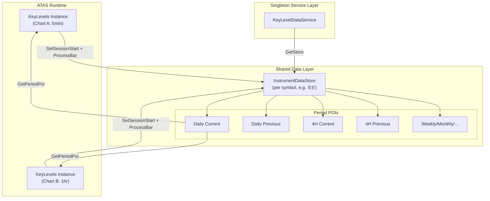
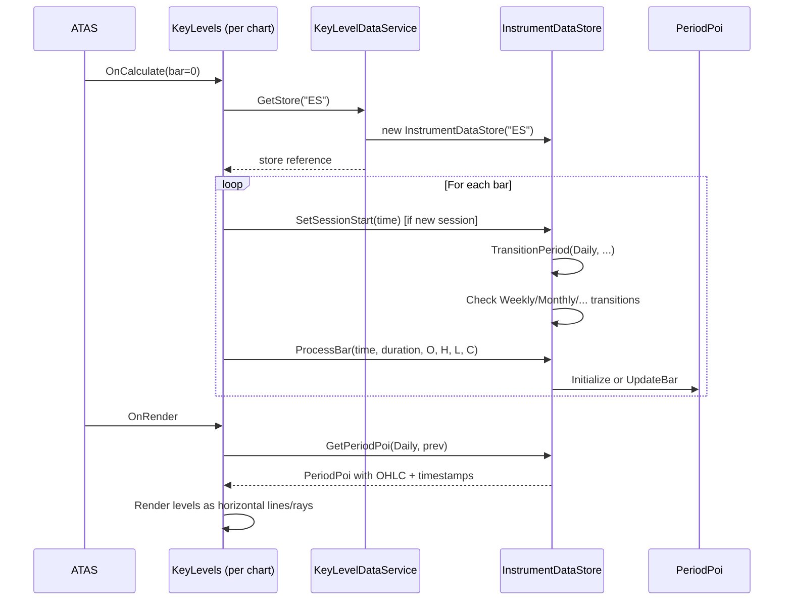

# Key Levels DataStore — Full Specification

> This document is the authoritative reference for the Key Levels data aggregation and storage architecture.
> Last updated: 2026-02-10

---

## 1. Purpose & Problem Statement

The Key Levels indicator renders horizontal price levels (Open, High, Low, Mid) for multiple time periods (4H, Daily, Weekly, Monthly, Quarterly, Yearly, Monday) on ATAS charts. A single instrument (e.g., ES) can have **multiple charts open simultaneously** with different timeframes and lookback windows. For example:

- Chart A: 5-minute, 3 days lookback
- Chart B: 1-hour, 30 days lookback

Both charts need to display the **same** key levels. The DataStore solves two fundamental problems:

1. **Cross-chart data sharing** — all indicator instances for the same instrument write to and read from a single shared store.
2. **Period boundary management** — the store centralizes the logic for determining when daily, weekly, monthly, etc. periods start and end, preventing conflicts from different lookback depths.

---

## 2. Architecture Overview



### Component Summary

| Component | Responsibility | Thread Safety |
|-----------|---------------|---------------|
| `KeyLevelDataService` | Singleton registry of `InstrumentDataStore` instances | `ConcurrentDictionary` |
| `InstrumentDataStore` | Owns period boundaries, receives bars, updates POIs | `lock(_lock)` |
| `PeriodPoi` | Stores OHLC + timestamps + granularity for one period | Mutated only under store lock |

---

## 3. Data Flow

### 3.1 Indicator → DataStore (Write Path)

Each `KeyLevels` indicator instance calls two methods during `OnCalculate`:

```csharp
protected override void OnCalculate(int bar, decimal value)
{
    EnsureDataStoreInitialized();

    var candle = GetCandle(bar);

    if (IsNewSession(bar))
        _dataStore.SetSessionStart(candle.Time);

    _dataStore.ProcessBar(candle.Time, GetCandleDurationMinutes(),
        candle.Open, candle.High, candle.Low, candle.Close);
}
```

**Key design choice**: the indicator sends **every bar individually** — no pre-aggregation. The store determines which periods the bar belongs to.

### 3.2 DataStore → Indicator (Read Path)

During rendering, the indicator reads POIs:

```csharp
var poi = _dataStore.GetPeriodPoi(PeriodType.Daily, isCurrent: false);
if (poi?.IsInitialized == true)
{
    levels.Add(new KeyLevel(poi.High, "PDH", color, poi.HighTime));
}
```

The `HighTime` / `LowTime` timestamps are used for **ray rendering** — drawing a horizontal line starting from where the extreme occurred.

---

## 4. `KeyLevelDataService` — Service Locator

```
Namespace: sadnerd.io.ATAS.KeyLevels.DataAggregation
File:      DataAggregation/KeyLevelDataService.cs
```

### Design
- **Singleton** via `Lazy<T>` — `KeyLevelDataService.Instance`
- Stores a `ConcurrentDictionary<string, InstrumentDataStore>` keyed by instrument symbol
- `GetStore(symbol)` — get-or-create, thread-safe
- `HasStore(symbol)` — existence check without creation
- `Reset()` — clears all stores (for testing)
- `StoreCount` — number of active stores

### Lifetime
Created on first access, lives for the ATAS process lifetime. Stores persist across chart recalculations — this is intentional, as `OnRecalculate` should not clear shared data.

---

## 5. `InstrumentDataStore` — Core Engine

```
Namespace: sadnerd.io.ATAS.KeyLevels.DataAggregation
File:      DataAggregation/InstrumentDataStore.cs
```

### 5.1 State

| Field | Type | Purpose |
|-------|------|---------|
| `_current` | `Dictionary<PeriodType, PeriodPoi?>` | Current (active/ongoing) POI per period type |
| `_previous` | `Dictionary<PeriodType, PeriodPoi?>` | Previous (completed) POI per period type |
| `_currentSessionStart` | `DateTime` | Timestamp of the most recent session start |
| `_lastTradingDay` | `DateTime` | Derived trading day of the last session (for transition detection) |
| `_lock` | `object` | All mutations go through this single lock |

### 5.2 `SetSessionStart(DateTime sessionStart)`

Called when any chart detects `IsNewSession(bar)`. This is the **period transition trigger**.

#### Guards
- Duplicate session starts are silently ignored (`sessionStart <= _currentSessionStart`)
- This prevents re-processing when multiple bars report the same session

#### Trading Day Derivation
```
GetTradingDay(sessionStart):
    if sessionStart.Hour >= 12 → sessionStart.Date + 1 day
    else → sessionStart.Date
```
**Rationale**: Futures sessions that start in the evening (e.g., 22:00 or 23:00 UTC) have their trading activity primarily on the *next* calendar day. A session starting at 23:00 on Sunday is Monday's trading day. DST shifts the session start between 22:00 and 23:00, but the derivation remains correct.

#### Period Transition Rules

| Period Type | Transition Condition | Boundary Time |
|-------------|---------------------|---------------|
| **Daily** | Every new session | Session start time |
| **Monday** | Trading day = Monday (and wasn't Monday before) | Session start time |
| **Weekly** | ISO week number changes (or year changes) | Session start time |
| **Monthly** | Month changes (or year changes) | Session start time |
| **Quarterly** | Quarter changes (or year changes) | Session start time |
| **Yearly** | Year changes | Session start time |
| **4H** | Handled in `ProcessBar`, not here | Computed from session start |

#### Monday Special Handling
- Monday period is created when the trading day is Monday
- Monday period is **finalized** (PeriodEnd set) when the trading day changes to Tuesday or later
- This allows Monday to span exactly one trading session

#### First Session Bootstrap
On the very first session, all higher timeframe periods (Weekly, Monthly, Quarterly, Yearly) are initialized with the session start. Monday is only initialized if the first trading day is actually a Monday.

### 5.3 `ProcessBar(DateTime barTime, int candleDurationMinutes, decimal open, decimal high, decimal low, decimal close)`

Called for every candle from every chart. The bar is matched to **all applicable periods**.

#### Algorithm

```
ProcessBar:
    1. ProcessBarFor4H(barTime, ...)           // 4H has custom logic
    2. UpdatePeriodIfActive(Daily, barTime, ...)
    3. UpdatePeriodIfActive(Monday, barTime, ...)
    4. UpdatePeriodIfActive(Weekly, barTime, ...)
    5. UpdatePeriodIfActive(Monthly, barTime, ...)
    6. UpdatePeriodIfActive(Quarterly, barTime, ...)
    7. UpdatePeriodIfActive(Yearly, barTime, ...)
```

#### `UpdatePeriodIfActive` Logic
```
if no current POI exists → skip
if bar is past period end → skip
if bar is before period start → skip
if POI not initialized → poi.Initialize(bar)
else → poi.UpdateBar(bar)
```

#### 4H Period Logic (`ProcessBarFor4H`)
4H periods are **session-aligned**, not clock-aligned. They subdivide the current session into 4-hour blocks:

```
hoursSinceSession = (barTime - sessionStart).TotalHours
periodIndex = floor(hoursSinceSession / 4)
periodStart = sessionStart + (periodIndex × 4 hours)
periodEnd = periodStart + 4 hours
```

When a bar falls into a new 4H block:
1. The current 4H POI becomes previous
2. A new 4H POI is created and immediately initialized

This means 4H transitions happen **within** `ProcessBar`, not in `SetSessionStart`.

### 5.4 `TransitionPeriod(PeriodType, DateTime periodStart)`

The internal mechanism for period rollovers:

```
1. If current POI exists and is initialized:
   a. Set PeriodEnd = periodStart (if still DateTime.MaxValue)
   b. Move to _previous[type]
2. Create new empty POI:
   - Type = type
   - IsCurrent = true
   - PeriodStart = periodStart
   - PeriodEnd = DateTime.MaxValue (ongoing)
3. Store in _current[type]
```

**Only one previous is kept** per period type. When a new transition occurs, the older previous is discarded.

### 5.5 Thread Safety Model

All public methods acquire `lock(_lock)`:
- `SetSessionStart`
- `ProcessBar`
- `GetPeriodPoi`
- `GetAllPeriods`
- `CurrentSessionStart` (property)
- `Clear`

Multiple charts feeding bars concurrently are serialized. Since bar processing is fast (O(1) per period type), lock contention is negligible.

---

## 6. `PeriodPoi` — Period Point of Interest

```
Namespace: sadnerd.io.ATAS.KeyLevels.DataAggregation
File:      DataAggregation/PeriodPoi.cs
```

### 6.1 Properties

#### Identity
| Property | Type | Set By | Description |
|----------|------|--------|-------------|
| `Type` | `PeriodType` | `init` | FourHour, Daily, Monday, Weekly, Monthly, Quarterly, Yearly |
| `IsCurrent` | `bool` | `init` | True = ongoing period, False = completed |
| `PeriodStart` | `DateTime` | `set` | When this period begins (session-aligned) |
| `PeriodEnd` | `DateTime` | `set` | When period ends. `DateTime.MaxValue` if ongoing |

#### OHLC Values
| Property | Type | Description |
|----------|------|-------------|
| `Open` | `decimal` | Price of the first bar in the period |
| `High` | `decimal` | Highest price across all bars in the period |
| `Low` | `decimal` | Lowest price across all bars in the period |
| `Close` | `decimal` | Price of the latest bar in the period |
| `Mid` | `decimal` | Computed: `Low + (High - Low) / 2` |

#### Timestamps (one per OHLC value)
| Property | Type | Description |
|----------|------|-------------|
| `OpenTime` | `DateTime` | Timestamp of the bar that set Open |
| `HighTime` | `DateTime` | Timestamp of the bar that set High |
| `LowTime` | `DateTime` | Timestamp of the bar that set Low |
| `CloseTime` | `DateTime` | Timestamp of the latest bar |

#### Granularity (candle duration in minutes, per OHLC value)
| Property | Type | Default | Description |
|----------|------|---------|-------------|
| `OpenTimeGranularity` | `int` | `int.MaxValue` | Candle duration of the bar that set Open |
| `HighTimeGranularity` | `int` | `int.MaxValue` | Candle duration of the bar that set High |
| `LowTimeGranularity` | `int` | `int.MaxValue` | Candle duration of the bar that set Low |
| `CloseTimeGranularity` | `int` | `int.MaxValue` | Candle duration of the bar that set Close |

#### Status
| Property | Type | Description |
|----------|------|-------------|
| `IsInitialized` | `bool` | True after the first bar has been processed |
| `LatestBarTime` | `DateTime` | Timestamp of the most recent bar |

### 6.2 `Initialize(barTime, candleDurationMinutes, open, high, low, close)`

Called for the **first bar** of a period. Sets all values uniformly:

```
Open = open; High = high; Low = low; Close = close
OpenTime = HighTime = LowTime = CloseTime = barTime
All Granularities = candleDurationMinutes
LatestBarTime = barTime
IsInitialized = true
```

### 6.3 `UpdateBar(barTime, candleDurationMinutes, high, low, close)`

Called for **subsequent bars**. The update algorithm:

```
HIGH:
    if high > High → update High, HighTime, HighTimeGranularity
    elif high == High AND candleDuration < HighTimeGranularity → update timestamp only
    else → no change

LOW:
    if low < Low → update Low, LowTime, LowTimeGranularity
    elif low == Low AND candleDuration < LowTimeGranularity → update timestamp only
    else → no change

CLOSE:
    Always update: Close = close, CloseTime = barTime, CloseTimeGranularity = candleDuration

OPEN:
    Never changes after Initialize.

LATEST:
    if barTime > LatestBarTime → LatestBarTime = barTime
```

### 6.4 Granularity Preservation

**Why track granularity?** When a 1-hour chart feeds a high of 5950 with timestamp 14:00, and a 5-minute chart later feeds the same high of 5950 with timestamp 14:25, the 5-minute timestamp is **more precise** — it narrows down when the high actually occurred from a 60-minute window to a 5-minute window.

The rule: **on equal price, the smaller candle duration wins**.

This is critical for ray rendering — a ray starting at 14:25 is more accurate than one starting at 14:00.

---

## 7. `PeriodType` Enum

```
Namespace: sadnerd.io.ATAS.KeyLevels.DataStore
File:      DataStore/PeriodData.cs
```

| Value | Description |
|-------|-------------|
| `FourHour` | 4-hour blocks aligned to session start |
| `Daily` | One trading session (session start to next session start) |
| `Monday` | Monday's trading session only |
| `Weekly` | ISO week (Monday through Friday) |
| `Monthly` | Calendar month |
| `Quarterly` | Calendar quarter (Q1=Jan-Mar, ...) |
| `Yearly` | Calendar year |

---

## 8. Key Levels Consumed Per Period

The indicator generates the following `KeyLevel` entries from each POI:

### Current Period Levels
| Period | Level | Source | Label (short) |
|--------|-------|--------|--------|
| 4H | Open | `curr4h.Open` at `OpenTime` | 4HO |
| Daily | Open | `currDay.Open` at `OpenTime` | DO |
| Quarterly | Open | `currQuarter.Open` at `OpenTime` | QO |
| Weekly | Open | `currWeek.Open` at `OpenTime` | WO |
| Monthly | Open | `currMonth.Open` at `OpenTime` | MO |
| Yearly | High/Low | `currYear.High/Low` at `HighTime/LowTime` | CYH/CYL |
| Yearly | Mid | `currYear.Mid` at `OpenTime` | CYM |

### Previous Period Levels
| Period | Level | Source | Label (short) |
|--------|-------|--------|--------|
| 4H | High/Low | `prev4h.High/Low` at `HighTime/LowTime` | P4HH/P4HL |
| 4H | Mid | `prev4h.Mid` at `OpenTime` | P4HM |
| Daily | High/Low | `prevDay.High/Low` at `HighTime/LowTime` | PDH/PDL |
| Daily | Mid | `prevDay.Mid` at `OpenTime` | PDM |
| Monday* | High/Low | `usedMonday.High/Low` at `HighTime/LowTime` | MDAYH/MDAYL |
| Monday* | Mid | `usedMonday.Mid` at `OpenTime` | MDAYM |
| Quarterly | High/Low | `prevQuarter.High/Low` | PQH/PQL |
| Quarterly | Mid | `prevQuarter.Mid` | PQM |
| Yearly | High/Low | `prevYear.High/Low` | PYH/PYL |
| Yearly | Mid | `prevYear.Mid` | PYM |
| Weekly | High/Low | `prevWeek.High/Low` | PWH/PWL |
| Weekly | Mid | `prevWeek.Mid` | PWM |
| Monthly | High/Low | `prevMonth.High/Low` | PMH/PML |
| Monthly | Mid | `prevMonth.Mid` | PMM |

*Monday uses a fallback strategy: prefer current week's Monday if initialized, otherwise use previous week's Monday.

---

## 9. DST & Timezone Handling

### Session Start Times
ATAS provides session start information through `IsNewSession(bar)`. The actual session start time varies with DST:
- **Summer (CET)**: session starts at 22:00 UTC (Sunday evening)
- **Winter (CET)**: session starts at 23:00 UTC (Sunday evening)

The DataStore does **not** apply timezone offsets. It relies on the times provided by ATAS, which are already adjusted.

### Impact on Period Boundaries
The `GetTradingDay` function correctly handles DST variations because it only checks `sessionStart.Hour >= 12`, which works for both 22:00 and 23:00 starts.

---

## 10. Multi-Chart Concurrency Model

### Scenario
Three charts are open for the same instrument (ES):
1. **5-min chart** — 3 days lookback, 864 bars
2. **15-min chart** — 7 days lookback, 672 bars
3. **1-hour chart** — 30 days lookback, 720 bars

### Bar Processing Order
Each chart's `OnCalculate` iterates through all its bars sequentially. But **across charts**, the order is non-deterministic — ATAS may recalculate any chart at any time.

### Correctness Guarantees

1. **Sessions**: `SetSessionStart` guards against duplicate/out-of-order calls. Only the first call with a given timestamp takes effect. Later charts with the same session start are no-ops.

2. **Period boundaries**: Determined by session transitions, not by individual bars. The first chart to report a session start establishes the boundary. All subsequent charts sending bars for that period simply update OHLC values.

3. **OHLC values**: `UpdateBar` only modifies High/Low if the new price is strictly more extreme (or equal with better granularity). This means bar order doesn't matter — the result is always the true H/L regardless of which chart sent which bar first.

4. **Granularity**: A 5-minute chart produces more precise timestamps than a 1-hour chart. When both feed the same extreme price, the 5-minute timestamp is kept.

5. **No data loss**: Unlike the previous `TimeRange` merging approach, individual bar processing cannot lose data. There is no "replacement" — only monotonic updates (higher highs, lower lows, latest close).

---

## 11. Lifecycle



### Recalculation Behavior
- `OnRecalculate` does **not** clear the data store. The store persists to maintain data from other charts.
- Each chart re-processes its bars during recalculation, which simply updates OHLC values (idempotent for bars already seen).

---

## 12. Source File Index

| File | Lines | Purpose |
|------|-------|---------|
| [InstrumentDataStore.cs](file:///e:/Projects/sadnerd.io.indicators-github/solution/sadnerd.io.ATAS.KeyLevels/DataAggregation/InstrumentDataStore.cs) | 326 | Core engine: session tracking, period transitions, bar processing |
| [PeriodPoi.cs](file:///e:/Projects/sadnerd.io.indicators-github/solution/sadnerd.io.ATAS.KeyLevels/DataAggregation/PeriodPoi.cs) | 118 | OHLC storage with per-value timestamps and granularity |
| [KeyLevelDataService.cs](file:///e:/Projects/sadnerd.io.indicators-github/solution/sadnerd.io.ATAS.KeyLevels/DataAggregation/KeyLevelDataService.cs) | 70 | Singleton registry of InstrumentDataStore instances |
| [PeriodData.cs](file:///e:/Projects/sadnerd.io.indicators-github/solution/sadnerd.io.ATAS.KeyLevels/DataStore/PeriodData.cs) | 105 | `PeriodType` enum + legacy `PeriodData` class |
| [KeyLevels.cs](file:///e:/Projects/sadnerd.io.indicators-github/solution/sadnerd.io.ATAS.KeyLevels/KeyLevels.cs) | ~1440 | Indicator: feeds bars to store, reads POIs for rendering |

---

## 13. Known Limitations & Future Work

1. **Only one "previous" per period** — if a user opens a chart with very shallow lookback (1 day), they won't see weekly/monthly previous data until enough sessions have been processed.

2. **No persistence** — data is in-memory only. Closing ATAS loses all accumulated data. Charts must re-process their bars on next load.

3. **`PeriodData` legacy** — the `DataStore/PeriodData.cs` file still contains the `PeriodData` class from the old `TimeBasedPeriodStore` architecture. It is used by `TimeBasedPeriodStore` which is still present in the codebase but no longer called by the indicator. Both can be removed in a future cleanup.

4. **4H periods reset per session** — the 4H period counter resets at each session start. This means the "previous 4H" always refers to the most recently completed 4-hour block within the current session, not the last 4H block of the previous session.
